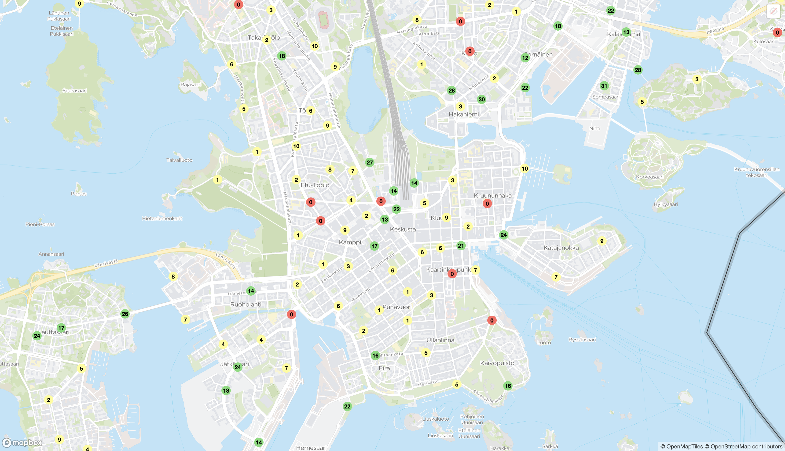

# minihsl

minihsl is a web application that displays all available city bikes in Helsinki using an interactive map. The app utilizes Mapbox for mapping, GraphQL for querying city bike data from the HSL API.




## Features

- **Interactive Map**: Displays all city bike stations on a Mapbox-powered map.
- **Real-time Data**: Fetches live data of city bike availability using GraphQL.
- **Custom Markers**: Shows different markers based on bike availability.
- **Geolocation**: Allows users to track their current location on the map.


## Technologies Used

- **React**: Frontend framework for building user interfaces.
- **Mapbox GL JS**: For rendering the map and handling map interactions.
- **GraphQL & Apollo Client**: For querying the city bike data and managing state.
- **HSL API**: Provides data and integrates with the map style.

## Getting Started

### Prerequisites

To run this project, you will need:

- **Node.js** and **npm**: Make sure you have Node.js installed, which also includes npm.
- **Mapbox API Key**: You need a Mapbox API key to use Mapbox services.
- **HSL API Key**: Required for accessing the HSL API services.

### Installation

1. **Clone the repository**:

    ```bash
    git clone https://github.com/yourusername/citybike-map.git
    cd citybike-map
    ```

2. **Install dependencies**:

    ```bash
    npm install
    ```

3. **Set up environment variables**:

    Create a `.env` file in the root directory and add your API keys:

    ```env
    VITE_MAPBOX_KEY=your_mapbox_api_key
    VITE_HSL_KEY=your_hsl_api_key
    ```

4. **Run the application**:

    ```bash
    npm run dev
    ```

    This will start the development server and open the app in your default browser.

## Code Overview

- **`App.jsx`**: Main component that initializes the Mapbox map and loads city bike data using GraphQL.
- **`graphql/queries.js`**: Contains GraphQL queries used in the application.
- **`assets/mapStyle.js`**: Configures custom map style settings using HSL API.
- **`index.jsx`**: Entry point for the React application, sets up Apollo Client for GraphQL queries.


